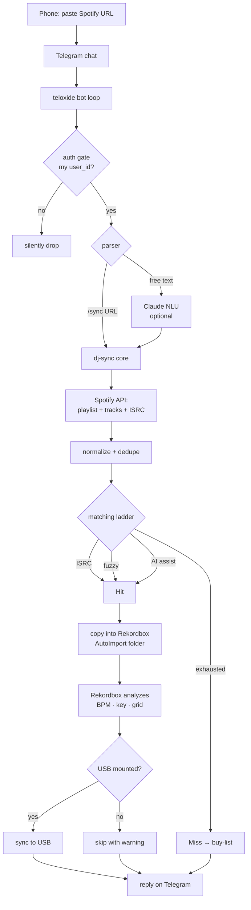
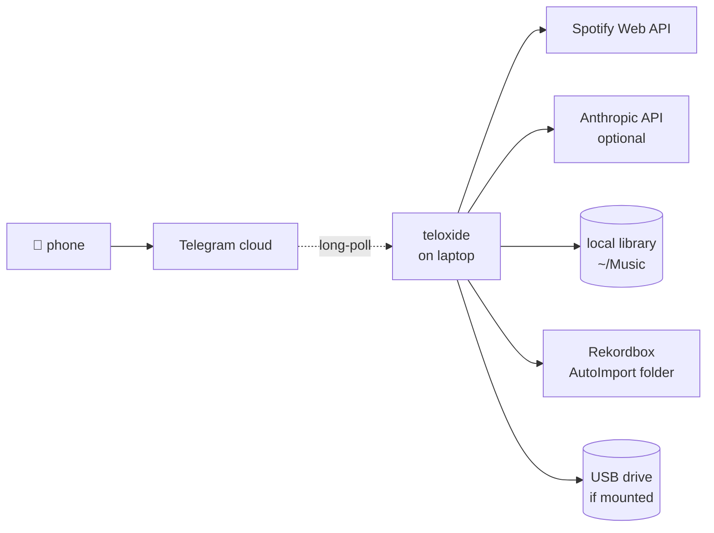

# 02 — Flow

Three views of the same pipeline, zoomed in differently.

## High-level (what happens when you paste a URL)



## Message-level (one round trip)

```
[1] User → Telegram
        "sync https://open.spotify.com/playlist/37i9dQZF1DX..."

[2] teloxide receives Update; auth gate checks user_id.

[3] parser.rs extracts:
        { action: Sync, source: Spotify(Playlist, "37i9dQZF1DX...") }

[4] core enqueues job; replies with:
        "🎧 starting sync — fetching playlist…"

[5] spotify.rs → 42 tracks, 41 ISRCs present.

[6] matcher.rs walks the ladder per track:
        36 ISRC hits, 3 fuzzy hits, 1 AI assist, 2 misses.

[7] rekordbox.rs copies 40 files into AutoImport.
    usb.rs skips (no drive mounted).

[8] core → Telegram (edits the original "starting sync…" message):
        ✅ 42 tracks processed
        ✅ 40 matched (36 ISRC · 3 fuzzy · 1 AI)
        ❌  2 missing — see /missing
        🎧 ready in Rekordbox
```

The bot edits its own first reply rather than spamming new messages — keeps the chat clean, gives a single status surface to look at on a phone.

## Network path



Notes:
- The phone never opens a connection to your laptop. Telegram's servers relay messages; teloxide long-polls outbound. No inbound port, no DDNS, no Tailscale required for the single-laptop case.
- Spotify and Anthropic calls are outbound HTTPS only.
- The library, Rekordbox folder, and USB drive are all local FS reads/writes — there is no network hop between dj-sync and your audio files.

## State transitions for one job

```
   Idle ──/sync URL──▶ FetchingPlaylist
                              │
                              ▼
                       NormalizingTracks
                              │
                              ▼
                          Matching ──(>50% miss)──▶ AutoRescanLibrary ──▶ Matching
                              │
                              ▼
                       WritingToRekordbox
                              │
                              ▼
                  ┌── USB mounted ──┐
                  ▼                 ▼
              SyncingUsb         (skip)
                  │                 │
                  └────────┬────────┘
                           ▼
                       Replying
                           │
                           ▼
                          Idle
```

A single shared `JobState` enum drives both the executor's branching and the bot's progress message — when it changes, the bot edits its reply with the new line.

## What the user actually experiences

1. You're at a friend's place, hear a track, find the playlist.
2. Long-press → share → Telegram → paste → send.
3. Within 10–60s (depends on playlist size), the bot reply edits to a final summary.
4. You get home, Rekordbox is already open with the new tracks analyzed.
5. Plug in USB, hit sync (or it's already synced), walk out the door.

The win is not speed — it's that the prep work happens in the background while you're doing other things, and the only friction is "paste a URL."
